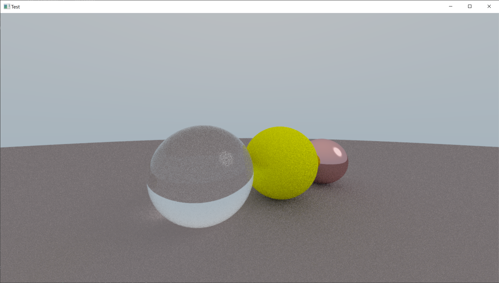

# triangle_tracing
A second raytracing attempt; this time primarily with triangles to allow object importing.

This now runs all the raytracing in openGL shaders, written in GLSL (and essentially only using SDL2). The result is passably real time rendering (with low sample counts); the lack of acceleration structures or any serious importance sampling/more complex techniques restricts the possible framerate.

